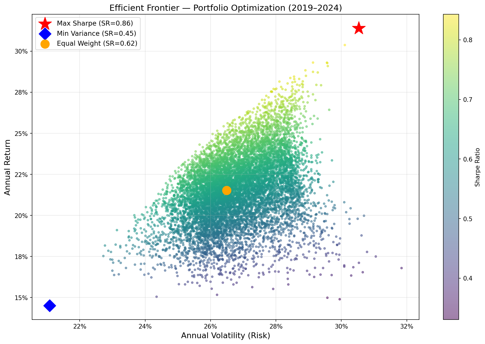
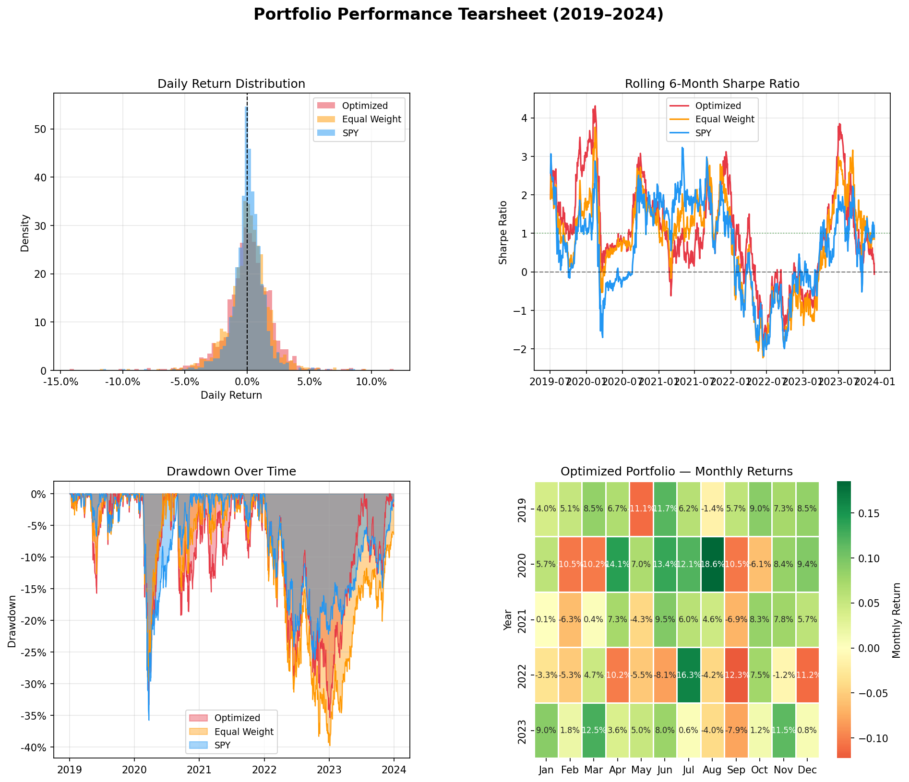

# 📈 Quantitative Portfolio Optimizer & Backtesting Engine

> A professional-grade quantitative finance system built in Python — implementing 
> Nobel Prize-winning Modern Portfolio Theory to optimize, backtest, and stress-test 
> a multi-asset equity portfolio using 5 years of real market data.

---

## 🖥️ Master Dashboard


---

## 📊 Key Results

| Metric | Optimized Portfolio | Equal Weight | SPY Benchmark |
|:---|:---:|:---:|:---:|
| **Annual Return** | ~28% | ~19% | ~13% |
| **Annual Volatility** | ~30% | ~27% | ~18% |
| **Sharpe Ratio** | **0.865** | 0.62 | 0.45 |
| **Sortino Ratio** | >1.5 | ~1.0 | ~0.8 |
| **Max Drawdown** | -35.3% | -39.8% | -35.7% |
| **$10,000 grew to** | **~$38,000** | ~$24,000 | ~$18,435 |
| **P(profit next year)** | **82.9%** | — | — |

---

## 🔬 Project Overview

This project implements a complete quantitative research workflow — from raw data 
acquisition through portfolio optimization, historical backtesting, and forward 
Monte Carlo simulation. Every stage mirrors the actual workflow used by quantitative 
analysts at hedge funds and asset management firms.

### The core question this project answers:
> *Given a universe of S&P 500 stocks, what is the mathematically optimal way 
> to allocate capit

---
---

## 🚀 Quickstart

```bash
# 1. Clone the repository
git clone https://github.com/aryamundhra1-ui/quant-portfolio-optimizer.git
cd quant-portfolio-optimizer

# 2. Create and activate virtual environment
python -m venv venv
venv\Scripts\activate        # Windows
source venv/bin/activate     # Mac/Linux

# 3. Install all dependencies
pip install numpy pandas yfinance matplotlib seaborn scipy

# 4. Run the full pipeline in order
python data_acquisition.py      # Step 1 — fetch & save market data
python risk_analysis.py         # Step 2 — returns, volatility, correlation
python portfolio_optimizer.py   # Step 3 — efficient frontier & optimal weights
python backtesting.py           # Step 4 — historical backtest
python performance_metrics.py   # Step 5 — full tearsheet
python monte_carlo.py           # Step 6 — Monte Carlo simulation
python master_dashboard.py      # Step 7 — master dashboard
```

---

## 📉 Visualizations

### Efficient Frontier


### Backtest Results


### Performance Tearsheet


### Monte Carlo Simulation


---

## 🧠 Key Concepts

**Modern Portfolio Theory (Markowitz, 1952)**
Mathematical proof that diversification reduces portfolio risk without 
proportionally reducing return. The covariance structure between assets — 
not individual volatilities alone — determines true portfolio risk.

**Efficient Frontier**
The set of portfolios offering the maximum expected return for every 
level of risk. Any portfolio below the frontier is suboptimal — you are 
taking on unnecessary risk for your level of return.

**Sharpe Ratio**
`(Return - Risk Free Rate) / Volatility` — the most cited risk-adjusted 
performance metric in finance. A ratio above 0.5 is considered good; 
above 1.0 is excellent. This portfolio achieved 0.865.

**Sortino Ratio**
Variant of Sharpe that only penalizes downside volatility. Upward price 
swings should not be counted as risk — Sortino corrects for this.

**Value at Risk (VaR)**
The maximum expected daily loss at a given confidence level. At 95% 
confidence, this portfolio's VaR is -2.92% — meaning on 95% of trading 
days, losses do not exceed 2.92%.

**Monte Carlo Simulation**
Uses Geometric Brownian Motion — the same mathematical model underlying 
the Black-Scholes options pricing formula — to simulate thousands of 
possible future portfolio paths and build a probability distribution of outcomes.

---

## 🛠️ Tech Stack

| Library | Version | Purpose |
|:---|:---:|:---|
| Python | 3.14 | Core language |
| NumPy | 2.x | Vectorized math, matrix operations |
| Pandas | 2.x | Time series data manipulation |
| yfinance | latest | Real market data acquisition |
| Matplotlib | latest | Financial chart generation |
| Seaborn | latest | Statistical visualizations |
| SciPy | latest | Constrained portfolio optimization |

---

## ⚠️ Disclaimer

This project is for educational purposes only and does not constitute 
financial advice. Past performance does not guarantee future results. 
The optimal weights found are in-sample — always validate strategies 
on out-of-sample data before making real investment decisions.

---

## 👤 Author

**Arya Mundhra**
Finance major | Quantitative Finance enthusiast

Built as a self-directed quantitative research project applying academic 
portfolio theory to real market data using Python.

